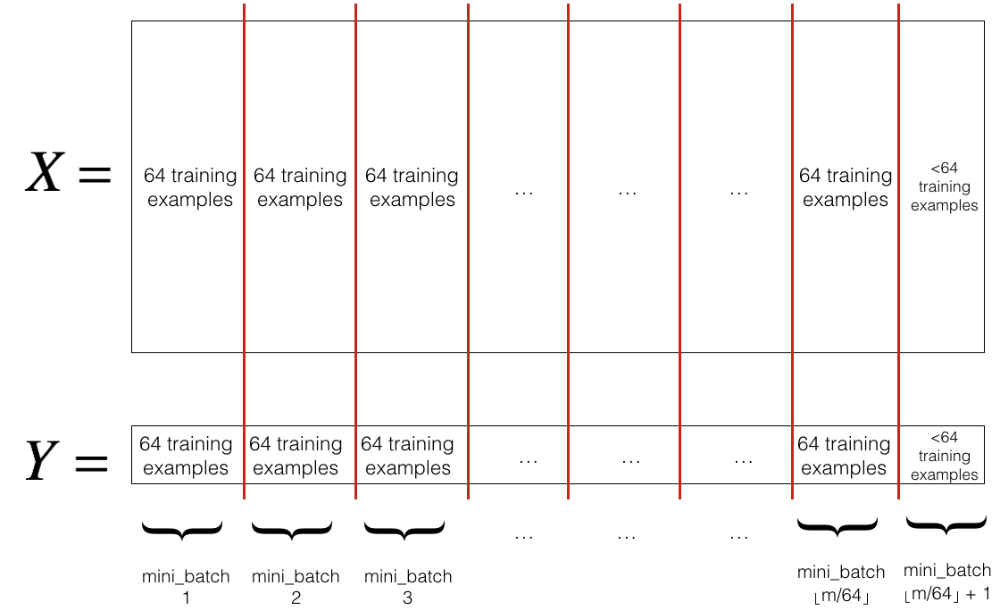

# Train/Dev/Test Sets

- Previous: 70/30, 60/20/20
- Big Data: 98/1/1
- Mismatched Train/Test Destribution
- Make sure Dev and Test come from same distribution

# Bias and Variance

1. high bias (train sets performance)
   - Bigger network
   - Train longer
   - NN architecture search
2. high variance (dev sets performance)
   - More data
   - Regularization
   - NN architecture search
3. Done

# L2 Regularization

$J(\omega, b)=\frac{1}{m} \sum_{i=1}^m L\left(\hat{y}^{(i)}, y^{(i)}\right)+\frac{\lambda}{2 m}\|\omega\|_2^2$

$J\left(\omega^{[1]}, b^{[1]}, \dots, \omega^{[L]}, b^{[L]}\right)=\frac{1}{m} \sum_{i=1}^m L\left(\hat{y}^{(i)}, y^{(i)}\right)+\frac{\lambda}{2 m} \sum_{l=1}^L\left\|\omega^{[l]}\right\|_{F}^2$

- Frobenius Norm: $\left\|\omega\right\|_F^2=\rm{Tr}(\omega^T\omega)$

$\begin{aligned} & d \omega^{[l]}=(\text {from backprop})+\frac{\lambda}{m} \omega^{[l]} \\ & \omega^{[l]}:=\omega^{[l]}-\alpha \cdot d \omega^{[l]}=(1-\frac{\alpha\lambda}{m})\omega^{[l]}-\alpha(\text {from backprop})\end{aligned}$

# Dropout Regularization

- Illustrate with layer 3, keep-prob = 0.8
- Forward Propagation
  - D3 = np.random.rand(A3.shape[0], A3.shape[1]) < keep-prob
  - A3 *= D3
  - A3 /= keep-prob

- Backward Propagation
  - dA3 *= D3
  - dA3 /= keep-prob

# Normalizing Training Sets

$x -= \mu,\  x /= \sigma$

# Weight Initialization

[Symmetry Breaking versus Zero Initialization](https://community.deeplearning.ai/t/symmetry-breaking-versus-zero-initialization/16061)

$z=\omega_1 x_1+\omega_2 x_2+...+\omega_n x_n+b$

$Var(\omega)=\frac{1}{n} \ or\  \frac{2}{n}$

$\omega^{[l]}=np.random.rand(shape)*np.sqrt(\frac{2}{n^{[l-1]}})$

- ReLU: $\sqrt{\frac{2}{n^{[l-1]}}}$

- tanh: $\sqrt{\frac{1}{n^{[l-1]}}}$

- Xavier initialization:  $\sqrt{\frac{2}{n^{[l-1]}+n^{[l]}}}$

# Numerical Approximation of Gradients

$\frac{f(\theta+\epsilon)-f(\theta+\epsilon)}{2\epsilon} \approx g(\theta)$

# Gradient Checking

Check $\frac{\left\|d \theta_{\text {approx }}-d \theta\right\|_2}{\left\|d \theta_{\text {approx }}\right\|_2+\|d \theta\|_2}$: $10^{-7}\ great,\ 10^{-5},\ 10^{-3}\ worry$

- Don't use in training
- If algorithm fails grad check, look at components and try to identify bug
- Remember regularization
- Doesn't work with dropout
- Run at random initialization perhaps again after some training

# Mini-batch Gradient Descent

- Mini-batch t: $X^{\{t\}}, Y^{\{t\}}$

- Mini-batch size = m: Batch gradient descent

  - training sets too large

- Mini-batch size = 1: Stochastic gradient descent

  - lose speedup from vectorization, inefficient

- In-between, mini-batch size not too big/small

  - fastest learning
  - vectorization

  - make progress without processing entire training set

- Choosing your mini-batch size

  - If small training set: use batch gradient descent. (m <= 2000)

  - Typical mini-batch size: 64, 128, 256, 512

  - Make sure mini-batch fit in CPU/GPU memory. $X^{\{t\}}, Y^{\{t\}}$

- Shuffle & Partition

  

# Exponentially Weighted Averages

- $\nu_t=\beta\nu_{t-1}+(1-\beta)\theta_t$

-  $(1-\epsilon)^{1/\epsilon}=\frac{1}{e}$, $\nu_t$近似是前$\frac{1}{1-\beta}$个的平均值

- Bias correction $\frac{\nu_t}{1-\beta^t}$, because assuming $\nu_0=0$

# Gradient Descent with Momentum

- $V_{d W}=\beta V_{d W}+(1-\beta) d W$
- $V_{d b}=\beta V_{d b}+(1-\beta) d b$
- $W:=W-\alpha V_{d W}, \quad b:=b-\alpha V_{d b}$

-  Hyperparameters: $\alpha, \beta$
  - $\beta=0.9$

# RMSprop

- $S_{d W}=\beta S_{d W}+(1-\beta) d W^2$

- $S_{d b}=\beta S_{d b}+(1-\beta) d b^2$

- $W:=W-\alpha \frac{dW}{\sqrt{S_{dW}}}, \quad b:=b-\alpha \frac{db}{\sqrt{S_{db}}}$

# Adam Optimization Algorithm

$$
\begin{aligned}
& V_{dW}=0,S_{dW}=0,V_{db}=0,S_{db}=0 \\
& \text{On iteration t:} \\
& \quad \text{Compute dW,db using current mini-batch} \\
& \quad V_{d W}=\beta_1 V_{d W}+(1-\beta_1) d W, V_{d b}=\beta_1 V_{d b}+(1-\beta_1) d b \quad \leftarrow momentum\ \beta_1 \\
& \quad S_{d W}=\beta_2 S_{d W}+(1-\beta_2) d W^2, S_{d b}=\beta_2 S_{d b}+(1-\beta_2) d b^2 \quad \leftarrow RMSprop\ \beta_2 \\
& \quad V_{dW}^{corrected}=V_{dW}/(1-\beta_1^{t}),V_{db}^{corrected}=V_{db}/(1-\beta_1^{t}) \\
& \quad S_{dW}^{corrected}=S_{dW}/(1-\beta_2^{t}),S_{db}^{corrected}=S_{db}/(1-\beta_2^{t}) \\
& \quad W:=W-\alpha \frac{V_{dW}^{corrected}}{\sqrt{S_{dW}^{corrected}}+\epsilon}, \quad b:=b-\alpha \frac{V_{db}^{corrected}}{\sqrt{S_{dW}^{corrected}}+\epsilon} \\
\end{aligned}
$$

- Hyperparameters choice

  - $\alpha$: needs to be tune
  - $\beta_1: 0.9 \qquad \rightarrow (dW)$

  - $\beta_2: 0.999 \quad \rightarrow (dW^2)$
  - $\epsilon$: $10^{-8}$
- Adam: Adaptive moment estimation
- Adam paper: https://arxiv.org/pdf/1412.6980.pdf

## Learning Rate Decay

- Decay on every iteration

  $\alpha=\frac{1}{1+decayRate \times epochNumber} \alpha_0$

- Fixed interval scheduling

  $\alpha=\frac{1}{1+\text { decayRate } \times\left\lfloor\frac{\text { epochNum }}{\text { timeInterval }}\right\rfloor} \alpha_0$

# Local Optima in Neural Networks

局部最小值概率非常小，更大可能是鞍点

# Tuning Process

- Try random values
- Don't use a grid
- Coarse to fine

# Hyperparameter tuning

- Picking hyperparameters at random

- Appropriate scale for hyperparameters
- Hyperparameters for exponentially weighted averages

# Hyperparameters Tuning in Practice

- Pandas: babysitting one model
- Caviar: training many models in parallel

# Batch Normalization

Given some intermediate values in NN: $z^{(1)}, \ldots, z^{(n)}$

- $\mu=\frac{1}{m} \sum_i z^{(i)}$
- $\sigma^2=\frac{1}{m} \sum_i\left(z^{(i)}-\mu\right)^2$

- $z_{\text {norm }}^{(i)}=\frac{z^{(i)}-\mu}{\sqrt{\sigma^2+\epsilon}}, \ \text{in case} \ \sigma=0$

- $\tilde{z}^{(i)}=\gamma z_{\text {norm }}^{(i)}+\beta$

Working with mini-batches

- Delete $b^{[l]}$
